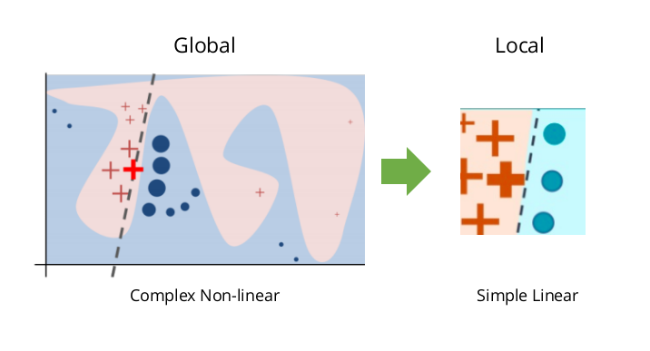
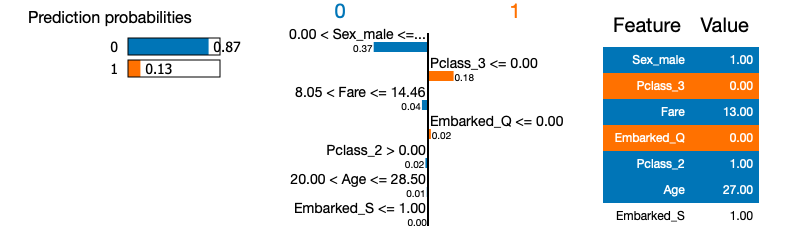

# Interpretability-methods-in-ML

## Interpretability methods in layman's terms
Say you have trained a complex algorithm that perform binary classification. Thus, the algorithm will classify every new data point either in Class A or Class B. For some reason you want to know why it classified a certain data point in Class A. Since it is a complex algorithm, it is not clear what led it to this decision for this particular data point. To understand this specific decision you can use an interpretability method. Such a method will tell you which features led the algorithm to its decision in this particular case.

## Why interpretability methods matter?
To tackle a regression or clasification problem, data scientists are often faced with the "performance vs. interpretability" trade-off regarding the choice of the algorithm:

* **Performance:** in many problems, complex algorithms such as neural networks or boosted trees achieve better results than simple regressions.
* **Interpretability:** simple algorithms such as linear regressions or decision trees are easier to understand and explain.

In some situation, one may have to be able to explain the decision of his algorithm and not simply follow it blindly. Then, he will sacrifice performance and choose a simpler algorithm...

Fortunately, explanatory methods have been developped, and allow one to choose a complex algorithm and explain its decisions.

## A simple interpretability method: LIME
LIME stands for Local Interpretable Model-agnostic Explanations. It is a really straightforward method that approximate locally your complex algorithm with a simpler one (e.g. a linera regression). For instance, if you want to understand the decision of your complex algorithm regarding a specific data point, LIME will generate a linear regression (or an other simple algorithm), fitted on the **predictions** of your complex algorithm, and the fitting process will only consider data points "close" to the one you want to explain. The idea is that locally, the decision process may be simpler than on the full data.

On the picture above, the decision boundary has been generated by a complex algorithm. Yet, locally, the boundary can be approximated with a linear boundary.

### LIME applied to the Titanic dataset
I use the famous Titanic dataset from Kaggle as a practical example to show how to use LIME in Python. I first fit a random forest with lots of trees (i.e. my complex algorithm) on the data. Then I use LIME to explain the decision of the random forest regarding specific data point. The goal here is to show how LIME works, for this reason I do not spend time to tune the best random forest possible. The notebook is called LIME_titanic and is located in the file LIME.

Here is an example. For this specific prediction made by the random forest, LIME tells us that the random forest predicts that passenger 221 did not survived mainly because he is a man (0 < Sex_male <= 1), who paid his ticket less than 15£ (8.05 < Fare < 14.46). It is interesting to note that the fact that passenger 221 did not travel in 3rd class misled the random forest. Yet it was not enough to change the decision of the random forest.

